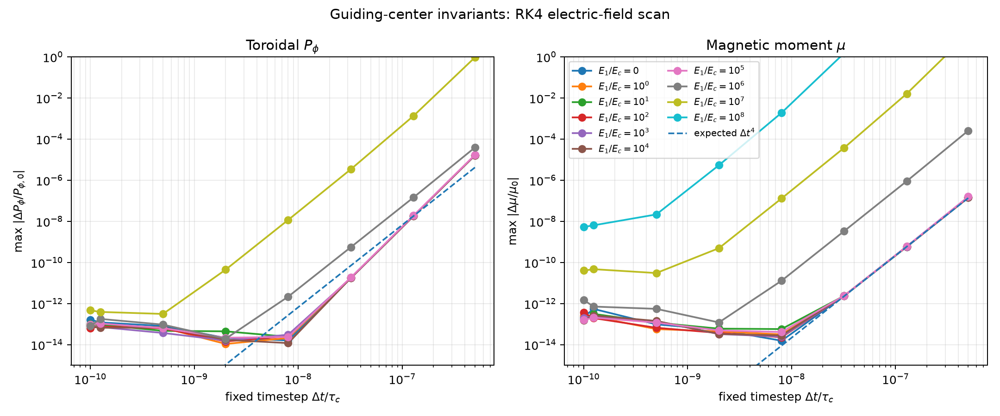
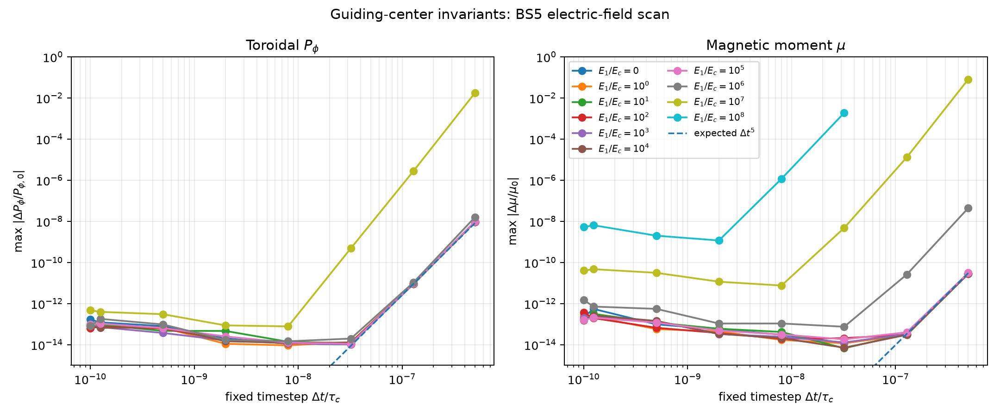
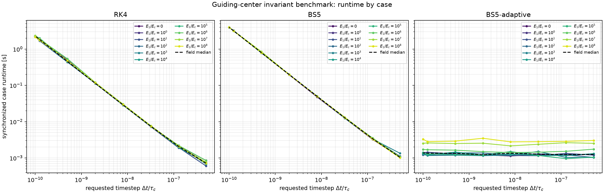
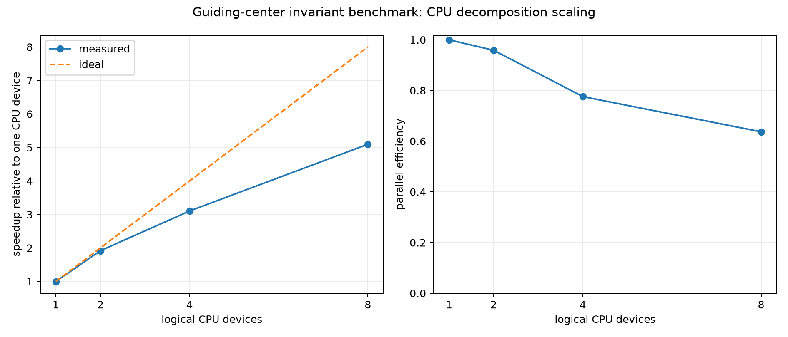

# Guiding-center invariant conservation

Collisionless circular guiding-center orbit benchmark. Electric acceleration,
synchrotron radiation, and stochastic collisions are disabled. The driver
measures toroidal canonical momentum and magnetic-moment error versus timestep
and integrator order, with the same particle push used for both diagnostics.

Run the full documented electric-field and timestep scan with:

```bash
PYTHONPATH=src:. JAX_PLATFORMS=cpu python \
  benchmarks/one_d/invariant_conservation/run.py \
  --output-dir benchmark_results/one_d/invariant_conservation_cpu
```

The output directory receives the raw CSV scan, a JSON run manifest, and
convergence/error-floor plots for RK4, fixed Bogacki--Shampine 5, and adaptive
Bogacki--Shampine 5(4). The driver is a physical benchmark
and is intentionally outside the coding-test suite. Its conservation targets
are analytical identities; the internal RAMc implementation supplies legacy
parameter conventions only and is not a published comparison source.
Each CSV row also records synchronized wall time for that specific
integrator/field/timestep case. The runtime figure shows all cases by
integrator; JAX compilation is warmed up before timing.

## CPU decomposition scaling

The same collisionless orbit problem also provides a serial/parallel CPU
scaling measurement. Scaling uses a fixed total workload of 512 markers and a
fixed RK4 case (`E1/Ec=10`, `dt/tau_c=1.28e-7`, final time `5e-4 tau_c`). Each
run partitions that same workload over logical XLA CPU devices with `jax.pmap`.
The first execution warms the compiled kernel; three synchronized executions
are then timed. Output includes measured wall time, speedup relative to one
device, ideal speedup, parallel efficiency, and a run manifest.

Expose the desired number of logical CPU devices before importing JAX:

```bash
XLA_FLAGS=--xla_force_host_platform_device_count=8 \
JAX_PLATFORMS=cpu PYTHONPATH=src:. python \
  benchmarks/one_d/invariant_conservation/run.py \
  --scaling --scaling-devices 1 2 4 8 \
  --output-dir benchmark_results/one_d/invariant_conservation_scaling_cpu
```

`--scaling-devices` must begin with `1`; every requested count must be exposed
by JAX and divide 512 evenly. This is strong scaling: total particle work is
fixed while device count changes. Devices are logical XLA devices used to test
the decomposition path, not a measurement of physical-core scaling. GPU
scaling is a separate backend benchmark and is not inferred from this CPU
result.

## Current CPU result

The clean result directory contains all three requested orbit schemes in one
CSV and separate convergence plots. Fixed RK4 and BS5 use the scanned timestep
as their physical integration step. Adaptive BS5 uses each scanned value as its
initial internal step and advances the same full physical interval with
`atol=rtol=10^{-9}`; accepted/rejected internal steps are recorded per row.

CSV, scan manifest, and plots retain every field/timestep point, including
actual timestep values after final-time quantization.

For the resolved field range \(E_1/E_c\le 10^7\), the smallest relative errors
observed anywhere in the scan are:

| Integrator | \(P_\phi\) | \(\mu\) |
|---|---:|---:|
| RK4 | \(1.09\times10^{-14}\) | \(1.57\times10^{-14}\) |
| fixed BS5 | \(9.33\times10^{-15}\) | \(6.72\times10^{-15}\) |
| adaptive BS5(4) | \(5.03\times10^{-9}\) | \(6.22\times10^{-11}\) |

The adaptive floor is consistent with its configured \(10^{-9}\) absolute and
relative tolerances. The \(E_1/E_c=10^8\) rows are retained as a high-field
stress probe; the coarsest steps there are non-finite or fail the adaptive
error controller and are not part of the resolved acceptance range.









