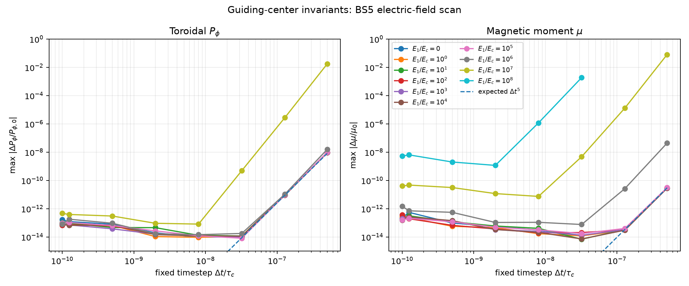
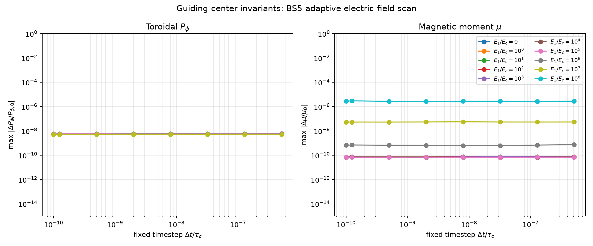
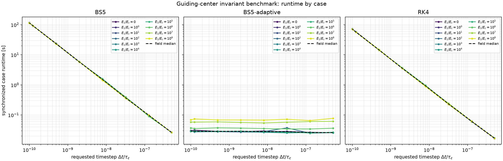
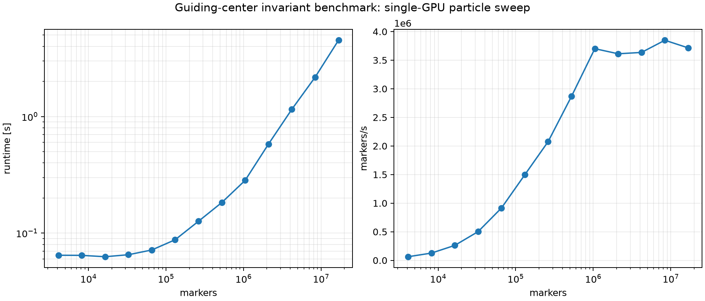
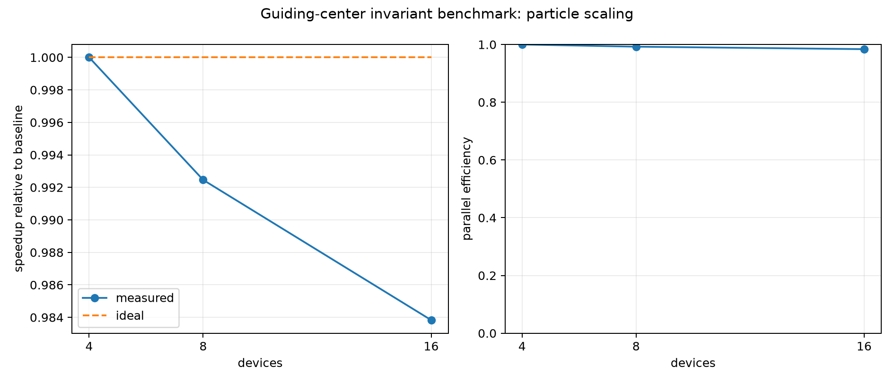

# Guiding-center invariant conservation

Collisionless circular guiding-center orbit benchmark. Electric acceleration,
synchrotron radiation, and stochastic collisions are disabled. The driver
measures toroidal canonical momentum and magnetic-moment error versus timestep
and integrator order, with the same particle push used for both diagnostics.

Run full scan on selected JAX backend. GPU command:

```bash
PYTHONPATH=src:. JAX_PLATFORMS=cuda python \
  benchmarks/one_d/invariant_conservation/run.py \
  --output-dir benchmark_results/one_d/invariant_conservation_gpu
```

CPU reference uses same command with `JAX_PLATFORMS=cpu` and an `_cpu` output
directory. Driver physics path is backend-independent.

The output directory receives the raw CSV scan, a JSON run manifest, and
convergence/error-floor plots for RK4, fixed Bogacki--Shampine 5, and adaptive
Bogacki--Shampine 5(4). The driver is a physical benchmark
and is intentionally outside the coding-test suite. Its conservation targets
are analytical identities; the internal RAMc implementation supplies legacy
parameter conventions only and is not a published comparison source.
Each CSV row also records synchronized wall time for that specific
integrator/field/timestep case. The runtime figure shows all cases by
integrator; JAX compilation is warmed up before timing.

## Particle scaling

The same collisionless orbit problem provides local and distributed particle
scaling. Scaling uses fixed 512-marker workload and fixed RK4 case
(`E1/Ec=10`, `dt/tau_c=1.28e-7`, final time `5e-4 tau_c`).
The first execution warms the compiled kernel; three synchronized executions
are then timed. Output includes measured wall time, speedup relative to one
device, ideal speedup, parallel efficiency, and a run manifest.

Local GPU scaling:

```bash
JAX_PLATFORMS=cuda PYTHONPATH=src:. python \
  benchmarks/one_d/invariant_conservation/run.py \
  --scaling --platform cuda --scaling-devices 1 2 4 \
  --scaling-particles 65536 \
  --output-dir benchmark_results/one_d/invariant_conservation_scaling_gpu
```

`--scaling-devices` counts local devices. Counts must start at `1`; every count
must be available and divide 512 evenly.

Measure GPU saturation before multi-GPU scaling:

```bash
JAX_PLATFORMS=cuda PYTHONPATH=src:. python \
  benchmarks/one_d/invariant_conservation/run.py \
  --platform cuda \
  --particle-sweep 512 1024 4096 16384 65536 262144 \
  --output-dir benchmark_results/one_d/invariant_conservation_particle_sweep_gpu
```

Use largest count that fits GPU memory and reaches stable markers/s. Use that
count for local and multi-node scaling.

Throughput mode uses shorter fixed case and fewer repeats:

```bash
--scaling-final-time 1e-5 --scaling-dt 1.28e-7 --scaling-repeats 1
```

Weak scaling grows total markers with device count:

```bash
--weak-scaling --particles-per-device 1048576 \
--scaling-final-time 1e-5 --scaling-dt 1.28e-7 --scaling-repeats 1
```

Multi-node Perlmutter scaling uses one process per node, four GPUs per process:

```bash
COORDINATOR=$(scontrol show hostnames "$SLURM_JOB_NODELIST" | head -n 1)
srun --nodes=4 --ntasks-per-node=1 --gpus-per-task=4 --gpu-bind=closest \
  bash -lc '
    export PYTHONPATH="$PWD/src:$PWD"
    export JAX_PLATFORMS=cuda
    export JAX_COORDINATOR_ADDRESS="'"$COORDINATOR"':12355"
    export JAX_NUM_PROCESSES="$SLURM_NTASKS"
    export JAX_PROCESS_ID="$SLURM_PROCID"
    export JAX_LOCAL_DEVICE_IDS=0,1,2,3
    .venv/bin/python benchmarks/one_d/invariant_conservation/run.py \
      --scaling --platform cuda --distributed --scaling-devices 1 2 4 \
      --scaling-particles 65536 \
      --output-dir benchmark_results/one_d/invariant_conservation_scaling_gpu_16
  '
```

Distributed rows report global device counts: 4, 8, 16. Run separate one-GPU
case for true 1-GPU baseline. `--distributed` uses explicit coordinator
variables above; Slurm auto-detection also works when variables are omitted.

Run each electric-field/timestep case independently on 16 GPUs:

```bash
sbatch benchmarks/one_d/invariant_conservation/run_cases_perlmutter.sbatch
```

Merge case outputs after completion:

```bash
PYTHONPATH=src:. .venv/bin/python \
  benchmarks/one_d/invariant_conservation/merge_cases.py \
  --inputs benchmark_results/one_d/invariant_cases_gpu/case_* \
  --output-dir benchmark_results/one_d/invariant_conservation_gpu
```

## Current GPU result

The GPU result directory contains all three requested orbit schemes in one CSV
and separate convergence plots. Fixed RK4 and BS5 use the scanned timestep
as their physical integration step. Adaptive BS5 uses each scanned value as its
initial internal step and advances the same full physical interval with
`atol=rtol=10^{-9}`; accepted/rejected internal steps are recorded per row.

CSV, scan manifest, and plots retain every field/timestep point, including
actual timestep values after final-time quantization.

For the resolved field range \(E_1/E_c\le 10^7\), the smallest relative errors
observed anywhere in the scan are:

| Integrator | \(P_\phi\) | \(\mu\) |
|---|---:|---:|
| RK4 | \(1.09\times10^{-14}\) | \(1.57\times10^{-14}\) |
| fixed BS5 | \(9.33\times10^{-15}\) | \(6.72\times10^{-15}\) |
| adaptive BS5(4) | \(5.03\times10^{-9}\) | \(6.22\times10^{-11}\) |

The adaptive floor is consistent with its configured \(10^{-9}\) absolute and
relative tolerances. The \(E_1/E_c=10^8\) rows are retained as a high-field
stress probe; the coarsest steps there are non-finite or fail the adaptive
error controller and are not part of the resolved acceptance range.








GPU scaling output appears under the selected `_gpu` result directory.

## GPU case results

Case-split GPU run `benchmark_results/one_d/invariant_conservation_gpu` contains
all 240 rows. Its manifest compares all rows against CPU reference output:

- matching rows: 240;
- missing rows: 0;
- finite-status mismatches: 0;
- maximum `$P_\phi$` error difference: `$1.56\times10^{-13}$`;
- maximum `$\mu$` error difference: `$1.12\times10^{-10}$`.

GPU results replace legacy CPU result directories after CPU/GPU comparison.

## GPU throughput result

80 GB A100 throughput scan covers `2^12` through `2^24` markers:

```text
benchmark_results/one_d/invariant_conservation_particle_sweep_gpu_powers/
```



Weak scaling uses `2^20` markers per GPU on 4, 8, and 16 GPUs:

```text
benchmark_results/one_d/invariant_conservation_weak_scaling_gpu80/
```



Measured weak-scaling runtime remains nearly constant: 0.2864, 0.2885, and
0.2911 seconds for 4, 8, and 16 GPUs.
