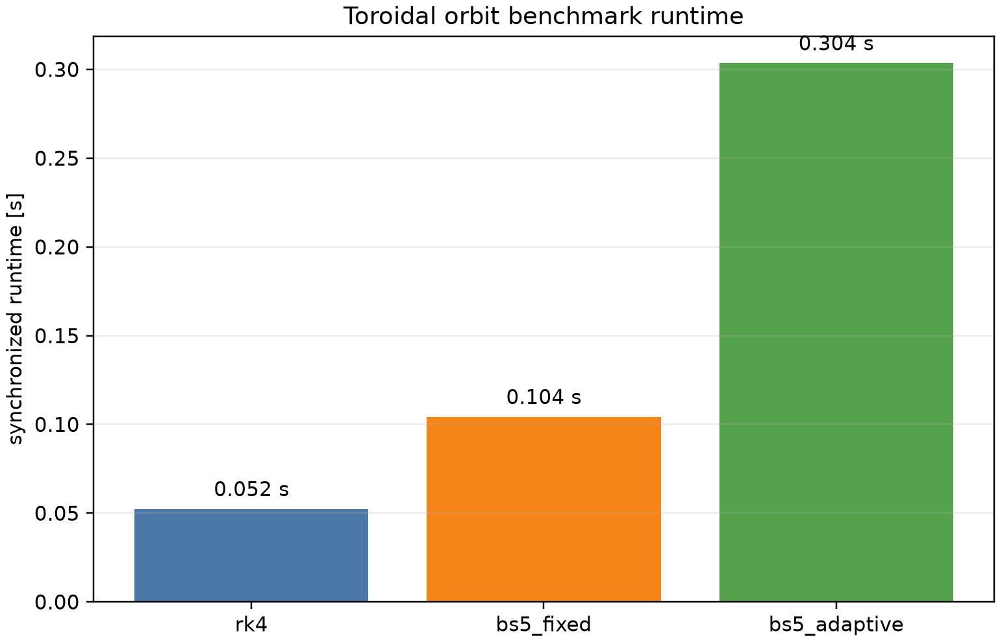

# Tokamak trapped and passing orbits

## Problem

This benchmark follows collisionless relativistic guiding-center trajectories
in the unshifted, axisymmetric circular tokamak field used by the JONTA 1-D
backend. The magnetic field is static and the inductive electric field,
synchrotron radiation, collisions, sources, and plasma feedback are disabled.

The benchmark contains one near-trapped orbit and one passing orbit at the same
energy. It measures orbit topology and long-time conservation over ten trapped
bounce periods before any stochastic operator is enabled.

## Equations

The deterministic characteristics are the circular guiding-center equations
implemented by src/orbits/ramc_circular.py. In the collisionless,
radiation-free, axisymmetric limit, the diagnostics are

$$
\bar P_\phi = \frac{R}{R_0}\frac{B_\phi}{B}\,\xi p
 + \frac{a\omega_{ce0}}{c}\frac{a}{R_0}
   \int_0^{r/a}\frac{r'}{q(r')}\,dr',
\qquad
\bar\mu = \frac{p^2(1-\xi^2)}{2\bar B},
$$

where \(p=\sqrt{\gamma^2-1}\), \(r/a=\sqrt{x^2+y^2}\), and

$$
q(r)=q_0+q_2 r^2,
\qquad
\frac{R}{R_0}=1+\epsilon x.
$$

The near-trapped orbit is identified by repeated sign changes of \(\xi\),
while the passing orbit retains one sign of \(\xi\) over the integration
interval. The reported banana width is

$$
\Delta r = \max_t r(t)-\min_t r(t).
$$

The bounce period is estimated from successive zero crossings of \(\xi(t)\).
These are trajectory diagnostics, not exact per-marker acceptance criteria;
the timestep and total integration time must be converged. The summary reports
the expected and observed classification separately, marking a one-crossing
trajectory as ambiguous rather than silently accepting it.

## Numerical method

The driver exposes four orbit integrators:

- `rk4`: classical fixed-step fourth-order Runge--Kutta;
- `bogacki_shampine5`: fixed-step fifth-order Bogacki--Shampine with its
  embedded fourth-order estimate;
- `bogacki_shampine5_adaptive`: bounded adaptive Bogacki--Shampine 5(4),
  matching the RAMc/PETSc `TSRK5BS` method with `atol=rtol=10^{-9}`;

The adaptive BS5(4) path advances each configured output interval to its exact
endpoint with marker-local accepted/rejected substeps. The fixed BS5 path is
used for order and timestep studies. The present acceptance targets are
analytical conservation and stable trapped/passing topology; digitized external
orbit data will be added when a published circular-tokamak target is selected.

## Analytic-equation reference and long comparison

The fields and circular guiding-center equations are analytic, but the
resulting orbit is not generally an elementary closed-form function of time.
In the static axisymmetric limit, \(H\), \(\mu\), and \(P_\phi\) are conserved;
these invariants define the exact orbit contour, with time obtained by
quadrature. The benchmark currently uses a tight-tolerance DOP853 integration
of the analytic RAMC RHS as a practical reference. It is not treated as an
RK4 reference.

Generate the analytic reference separately, then run the selected methods with
identical output sampling:

```bash
MPLCONFIGDIR=/tmp/jonta-mpl JAX_PLATFORMS=cpu PYTHONPATH=src:. python \
  benchmarks/one_d/tokamak_orbits/analytic_reference.py \
  --dt 2.5e-7 --final-time 8.3e-4 \
  --output-dir benchmark_results/one_d/tokamak_orbits/analytic_reference

MPLCONFIGDIR=/tmp/jonta-mpl JAX_PLATFORMS=cpu PYTHONPATH=src:. python \
  benchmarks/one_d/tokamak_orbits/run.py \
  --integrator bogacki_shampine5_adaptive --dt 2.5e-7 --final-time 8.3e-4 \
  --output-dir benchmark_results/one_d/tokamak_orbits/bs5_adaptive

MPLCONFIGDIR=/tmp/jonta-mpl python \
  benchmarks/one_d/tokamak_orbits/compare_reference.py \
  --reference-dir benchmark_results/one_d/tokamak_orbits/analytic_reference \
  --method rk4=benchmark_results/one_d/tokamak_orbits/rk4 \
  --method bs5_fixed=benchmark_results/one_d/tokamak_orbits/bs5_fixed \
  --method bs5_adaptive=benchmark_results/one_d/tokamak_orbits/bs5_adaptive \
  --output-dir benchmark_results/one_d/tokamak_orbits/reference_comparison
```

For this matched window the trapped marker executes ten complete bounce
periods (twenty pitch-sign crossings), while the passing marker completes many
poloidal turns without changing topology. Runtime is recorded in every
manifest and must be reported with any comparison table.

Current synchronized CPU timings from the canonical result directories
(compilation excluded):

| Method | Steps | Runtime |
|---|---:|---:|
| Analytic RHS, DOP853 reference | adaptive | 3.65 s |
| RK4 | 3320 | 0.052 s |
| Fixed BS5 | 3320 | 0.104 s |
| Adaptive BS5(4) | 3320 output intervals | 0.304 s |

At the baseline timestep, the maximum errors against the analytic reference
over both markers were \(6.08\times10^{-7}\) in \(r\) and
\(4.17\times10^{-7}\) in \(\xi\) for RK4, \(1.75\times10^{-10}\) and
\(4.08\times10^{-10}\) for fixed BS5, and \(2.23\times10^{-10}\) and
\(4.80\times10^{-10}\) for adaptive BS5(4). All methods preserved the
trapped/passing classification in this resolved case.

## Reproduction

Run the default trajectory case with:

```bash
MPLCONFIGDIR=/tmp/jonta-mpl JAX_PLATFORMS=cpu PYTHONPATH=src:. python benchmarks/one_d/tokamak_orbits/run.py --output-dir benchmark_results/one_d/tokamak_orbits/rk4
```

The output directory contains the trajectory table, summary table, JSON
manifest, and figures for orbit topology, the poloidal \(R\)--\(Z\) projection,
and invariant histories. The summary table includes synchronized runtime for
each marker case (the method runtime is identical across markers). The
circular embedding is

$$
R/R_0=1+\epsilon r\cos\theta,\qquad Z/R_0=\epsilon r\sin\theta.
$$

## CPU decomposition scaling

Scaling keeps the total marker count fixed and partitions identical trapped and
passing cases across logical XLA CPU devices:

```bash
XLA_FLAGS=--xla_force_host_platform_device_count=8 MPLCONFIGDIR=/tmp/jonta-mpl JAX_PLATFORMS=cpu PYTHONPATH=src:. python benchmarks/one_d/tokamak_orbits/run.py --scaling --scaling-devices 1 2 4 8 --output-dir benchmark_results/one_d/tokamak_orbits/scaling_cpu
```

The scaling output reports measured speedup, ideal speedup, and efficiency.
Logical XLA devices test the decomposition path; they are not a claim about
physical-core scaling or GPU performance.

The reference-comparison command also writes reference_runtime.png, a
separate runtime figure. Runtime is intentionally not placed on a secondary
axis of the trajectory-error plot: it is one scalar per method, rather than a
quantity that evolves with orbit time.


