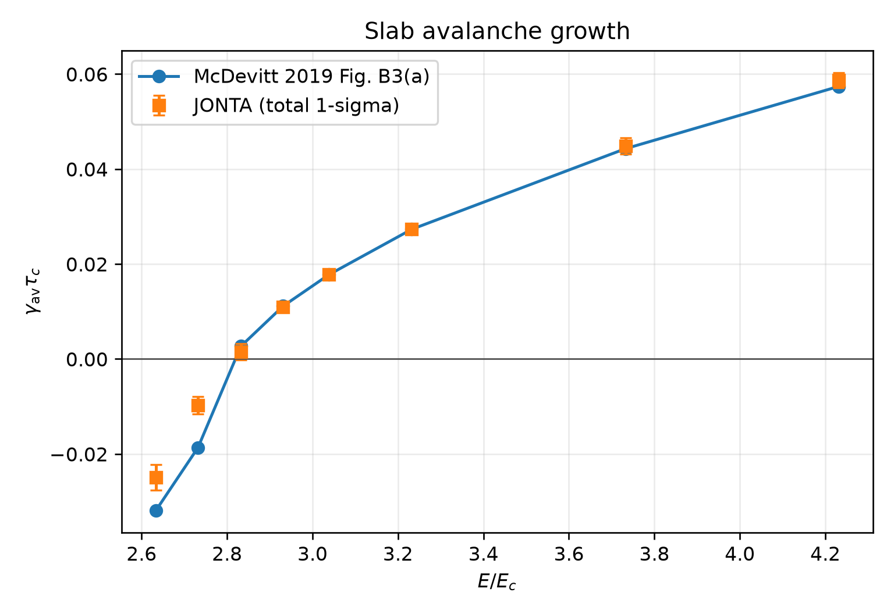
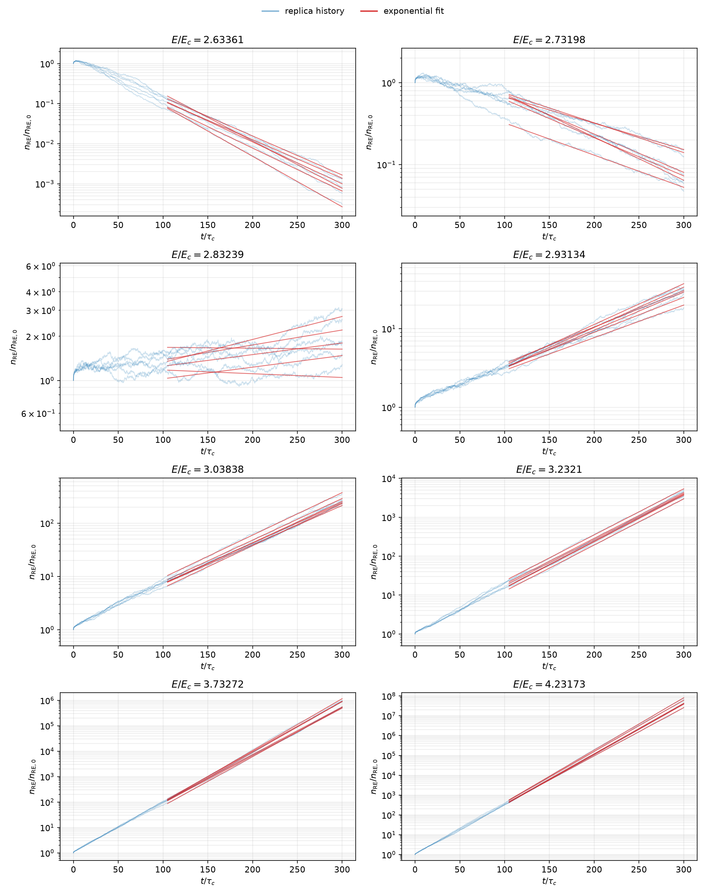

# McDevitt 2019 slab avalanche growth

This benchmark reproduces the source-limit avalanche growth curve in Fig. B3(a)
of McDevitt, Guo & Tang, *Plasma Physics and Controlled Fusion* **61**, 054008
(2019). The problem is homogeneous and slab-like: spatial transport and bulk
plasma coupling are disabled.

The marker distribution evolves with electric acceleration, synchrotron
radiation reaction, cumulative small-angle collisions, and source-only Møller
large-angle collisions. The measured observable is the exponential growth rate
of the weighted runaway population,

\[
\frac{n_{\rm RE}(t)}{n_{\rm RE,0}}
\simeq \exp\!\left(\gamma_{\rm av} t\right),
\qquad
\gamma_{\rm av} = \frac{d}{dt}\ln n_{\rm RE}(t).
\]

The published curve is digitized in
[`reference/mcdevitt_2019_figB3_B13.csv`](reference/mcdevitt_2019_figB3_B13.csv),
with provenance recorded in
[`reference/metadata.yaml`](reference/metadata.yaml). It is comparison data,
not simulation input.

## Reproduce the accepted scan

From the repository root, on a CPU host with six logical JAX devices:

```bash
XLA_FLAGS=--xla_force_host_platform_device_count=6 \
PYTHONPATH=src:. JAX_PLATFORMS=cpu MPLBACKEND=Agg \
  .venv/bin/python benchmarks/slab/avalanche_decay/run.py \
  --mode parallel --devices 6 --resume
```

The configuration performs four below/near-threshold cases with 512 markers per
device, six independent replicas, and 300 \(\tau_c\) of evolution:

- \(\Delta t = 2.5\times10^{-3}\,\tau_c\);
- large-angle interval \(\Delta t_{\rm LA}=5.0\times10^{-2}\,\tau_c\);
- fixed small-angle subcycling from \(N_{\rm SA}=100\) and
  \(p_{\min}=3v_{Te}/c=0.3\);
- six CPU devices, giving 3072 markers per replica.

The driver checkpoints each field. Re-running with `--resume` skips completed
fields. Results are written to
[`benchmark_results/slab/avalanche_decay/b3a_512/`](../../../benchmark_results/slab/avalanche_decay/b3a_512/):

- [`b3a_growth.csv`](../../../benchmark_results/slab/avalanche_decay/b3a_512/b3a_growth.csv)
  contains growth rates, replica SEM, fit-window sensitivity, and runtime;
- [`b3a_histories.csv`](../../../benchmark_results/slab/avalanche_decay/b3a_512/b3a_histories.csv)
  contains every replica history and its exponential fit;
- [`b3a_growth.png`](../../../benchmark_results/slab/avalanche_decay/b3a_512/b3a_growth.png)
  compares JONTA with the digitized paper curve;
- [`b3a_histories.png`](../../../benchmark_results/slab/avalanche_decay/b3a_512/b3a_histories.png)
  shows the marker histories and fit overlays;
- [`manifest.json`](../../../benchmark_results/slab/avalanche_decay/b3a_512/manifest.json)
  records the resolved parameters, backend, precision, and uncertainty rule.

## Accepted result

The 512-marker scan gives:

| \(E/E_c\) | JONTA \(\gamma_{\rm av}\tau_c\) | McDevitt | residual | total \(1\sigma\) | mean \(R^2\) |
|---:|---:|---:|---:|---:|---:|
| 2.63361 | -0.02494 | -0.03189 | +0.00695 | 0.00272 | 0.997 |
| 2.73198 | -0.00974 | -0.01866 | +0.00892 | 0.00181 | 0.988 |
| 2.83239 | +0.00147 | +0.002696 | -0.00122 | 0.00172 | 0.505 |
| 2.93134 | +0.01090 | +0.01115 | -0.00025 | 0.00106 | 0.991 |

## Figure: growth-rate comparison



The growth-rate figure reproduces the expected transition from decay to
avalanche growth as (E/E_c) increases. The two lowest-field cases have
negative fitted rates, the (E/E_c=2.83239) case lies in the threshold region,
and the (E/E_c=2.93134) case has positive growth and agrees closely with the
digitized McDevitt value. The lower-field decay rates are on the correct branch
but retain a systematic offset from the paper curve; this is the remaining
finite-marker/model-resolution component of the comparison. Error bars combine
replica statistics with fit-window sensitivity.

## Figure: marker histories and exponential fits



This figure shows all six independent weighted-marker histories for each field
and the corresponding exponential fits. The (E/E_c=2.63361), 2.73198, and
2.93134 histories remain close to straight lines on the logarithmic axis,
consistent with their high (R^2) values. At (E/E_c=2.83239), the population
remains close to the separatrix and fluctuations dominate; the low (R^2) is a
diagnostic that the fitted rate is not a well-conditioned exponential
measurement. That case is therefore retained to locate the threshold, not used
as a resolved growth-rate point.

Reported plot errors combine the replica SEM with the RMS sensitivity to the
fit-window choice. Marker-resolution convergence is a separate systematic
study.

The broad McDevitt figure suite, conservative gain-loss comparison, cutoff
study, and partially screened cases remain separate follow-on benchmarks.
