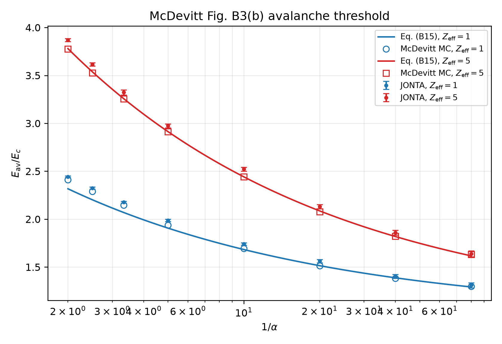
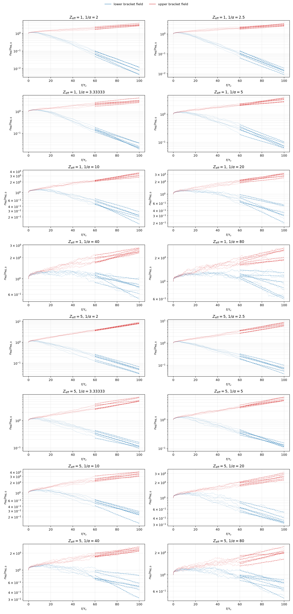

# McDevitt 2019 slab avalanche threshold

This benchmark reproduces Fig. B3(b) of McDevitt, Guo & Tang, *Plasma Physics
and Controlled Fusion* **61**, 054008 (2019). It measures the electric-field
threshold for avalanche growth in the homogeneous slab limit while varying the
synchrotron parameter \(\alpha\) and effective charge \(Z_{\rm eff}\).

The threshold is defined by the zero of the fitted runaway growth rate,

\[
\gamma_{\rm av}(E_{\rm av})=0,
\qquad
\frac{n_{\rm RE}(t)}{n_{\rm RE,0}}
\simeq \exp\!\left(\gamma_{\rm av}t\right).
\]

The analytic comparison is McDevitt et al. Eq. (B15),

\[
\frac{E_{\rm av}}{E_c}
 = 1+1.0906\left[\alpha^{0.6}(Z_{\rm eff}+1)\right]^{0.6801}.
\]

The paper uses \(\ln\Lambda=20\), \(\gamma_{\min}^{LA}=1.02\), a low-energy
boundary at \(\gamma_{\min}^{LA}\), and 100 \(\tau_c\) of evolution. The
simulation scans the electric field around Eq. (B15), then linearly
interpolates the two fitted growth rates that bracket zero. The analytic curve
is used only to choose the initial bracket; the reported JONTA threshold comes
from the particle calculation.

The open-circle Monte Carlo markers are digitized in
[`reference/mcdevitt_2019_figB3b.csv`](reference/mcdevitt_2019_figB3b.csv).
Their provenance and uncertainty are recorded in
[`reference/metadata.yaml`](reference/metadata.yaml).

## Reproduce the scan

From the repository root, using six logical CPU devices:

```bash
XLA_FLAGS=--xla_force_host_platform_device_count=6 \
PYTHONPATH=src:. JAX_PLATFORMS=cpu MPLBACKEND=Agg \
  .venv/bin/python benchmarks/slab/avalanche_threshold/run.py \
  --mode parallel --devices 6 --resume
```

The production configuration uses 512 markers per device, six independent
replicas, fixed \(N_{\rm SA}=100\) small-angle subcycling, and
\(\Delta t=2.5\times10^{-3}\,\tau_c\). The `field.e_scan` entries are the
published inverse-parameter grid
\(1/\alpha=[2,2.5,10/3,5,10,20,40,80]\).

The driver checkpoints each completed \((Z_{\rm eff},1/\alpha)\) case. Output
is written to
[`benchmark_results/slab/avalanche_threshold/b3b_512/`](../../../benchmark_results/slab/avalanche_threshold/b3b_512/):

- `b3b_threshold.csv`: threshold values, Eq. (B15), digitized Monte Carlo
  values, propagated uncertainty, and runtime;
- `b3b_threshold_scan.csv`: every field bracket and fitted growth rate;
- `b3b_histories.csv`: all marker histories used in the bracket scans;
- `b3b_threshold.png`: threshold comparison figure;
- `b3b_histories.png`: bracket-history diagnostic figure;
- `manifest.json`: resolved parameters, backend, precision, and uncertainty rule.

## Results

The numerical table below is copied from the checked-in production output
(`b3b_threshold.csv`). The JONTA uncertainty combines the replica standard
error with the fitted-window RMS in quadrature, then propagates those growth
rate uncertainties through the linear zero crossing. The paper values are
digitizations of the open circles, with an estimated rasterization uncertainty
of about 0.01 in \(E_{\rm av}/E_c\); they are not additional JONTA runs.

| \(Z_{\rm eff}\) | \(1/\alpha\) | JONTA \(E_{\rm av}/E_c\) | McDevitt MC* | Eq. (B15) | JONTA total \(1\sigma\) |
|---:|---:|---:|---:|---:|---:|
| 1 | 2 | 2.443 | 2.290 | 2.317 | 0.008 |
| 1 | 2.5 | 2.325 | 2.170 | 2.202 | 0.010 |
| 1 | 10/3 | 2.178 | 2.147 | 2.069 | 0.010 |
| 1 | 5 | 1.987 | 1.939 | 1.906 | 0.011 |
| 1 | 10 | 1.741 | 1.690 | 1.683 | 0.012 |
| 1 | 20 | 1.563 | 1.510 | 1.515 | 0.017 |
| 1 | 40 | 1.402 | 1.383 | 1.388 | 0.020 |
| 1 | 80 | 1.310 | 1.299 | 1.292 | 0.027 |
| 5 | 2 | 3.870 | 3.530 | 3.780 | 0.015 |
| 5 | 2.5 | 3.615 | 3.260 | 3.538 | 0.018 |
| 5 | 10/3 | 3.323 | 3.255 | 3.257 | 0.026 |
| 5 | 5 | 2.974 | 2.913 | 2.913 | 0.020 |
| 5 | 10 | 2.522 | 2.440 | 2.442 | 0.021 |
| 5 | 20 | 2.131 | 2.080 | 2.086 | 0.021 |
| 5 | 40 | 1.859 | 1.810 | 1.819 | 0.025 |
| 5 | 80 | 1.638 | 1.630 | 1.617 | 0.031 |

*Digitized from the published panel by mapping the marker centers to the
linear plot axes; see the reference metadata for the digitization convention
and uncertainty estimate.*

### Threshold comparison



This figure tests both the dependence on synchrotron strength and the
dependence on \(Z_{\rm eff}\). After correcting the paper grid and digitizing
the marker centers, the JONTA points remain systematically above the paper
markers at low \(1/\alpha\), while the high-\(1/\alpha\) points approach both
the markers and Eq. (B15). For example, at \(1/\alpha=10/3\), JONTA gives
2.178 (\(Z_{\rm eff}=1\)) and 3.323 (\(Z_{\rm eff}=5\)), compared with the
digitized values 2.147 and 3.255. This comparison is now on the actual paper
abscissae; the remaining offset is a physics/numerical discrepancy to
investigate, not a digitization artifact.

### Bracket histories



Each panel shows the independent marker histories at the lower and upper field
used to locate one threshold. The two field populations should decay and grow,
respectively. Faint solid curves are the six independent histories; dashed
curves are the exponential fits over the final 40% of the run used to obtain
each growth rate. The high-\(1/\alpha\), \(Z_{\rm eff}=1\) cases visibly become
noisier as the lower-bracket population approaches the fixed marker floor. The
corresponding minimum bracket-fit \(R^2\) values are 0.66 for
\((Z_{\rm eff},1/\alpha)=(1,80)\) and 0.81 for \((5,80)\). These diagnostics are
retained in `b3b_threshold_scan.csv`; the quoted threshold errors therefore
should not be interpreted as eliminating this late-time fit-quality limitation.
