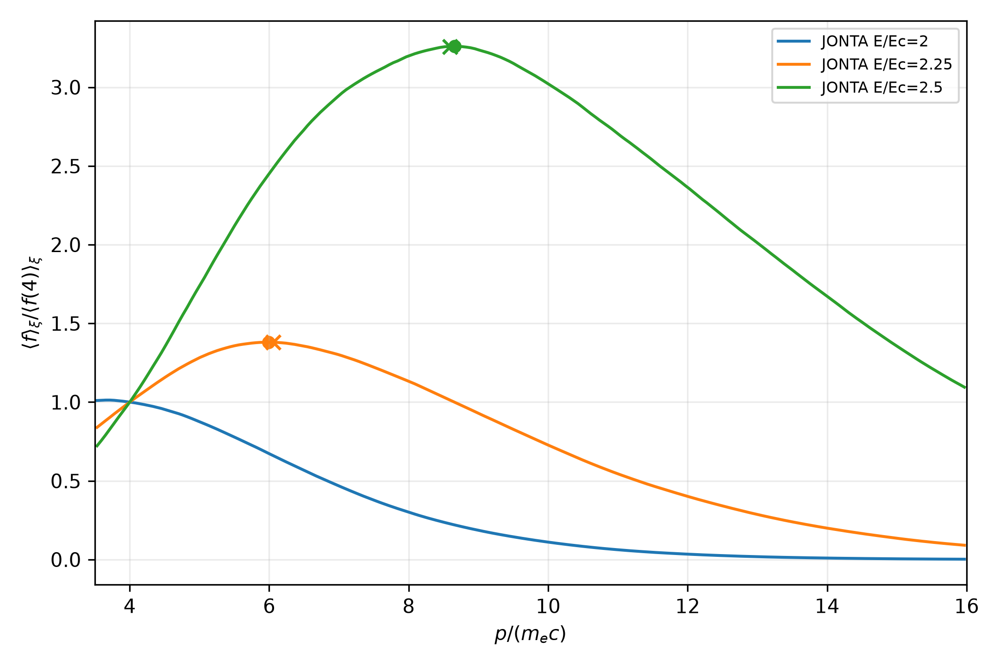
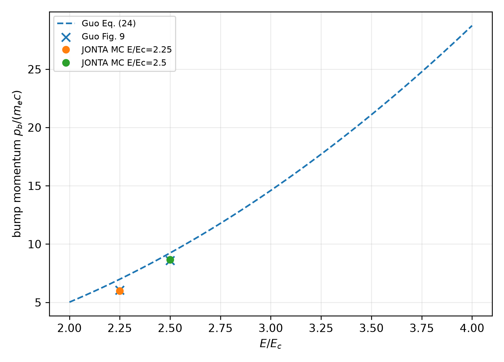
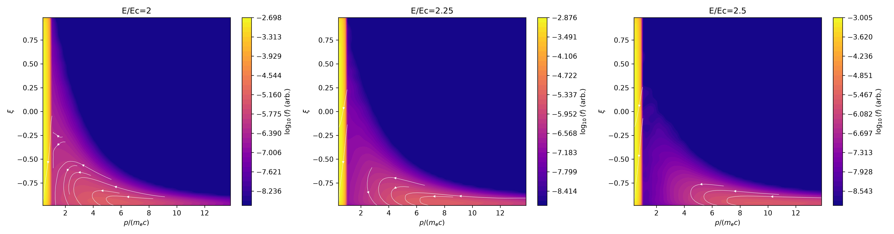
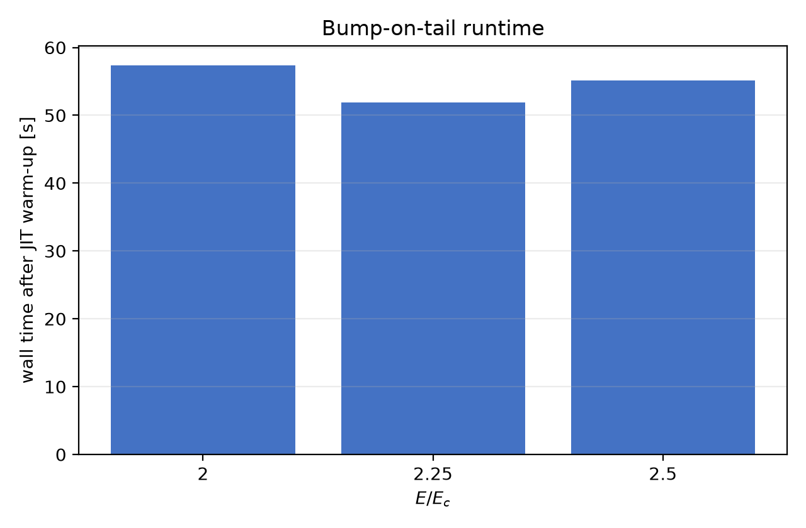
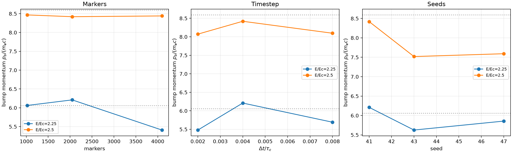
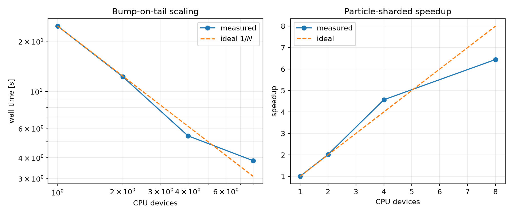

# Bump-on-tail (runaway-vortex) benchmark

This is a spatially homogeneous, linearized test-particle calculation for
relativistic electrons in a prescribed Maxwellian background. It exercises
the production 0D particle pusher with parallel electric acceleration,
small-angle Coulomb collisions, and synchrotron radiation reaction. Large-
angle collisions, sources, and bulk-plasma coupling are disabled.

## Physical model

Let \(p\) be momentum in units of \(m_ec\), \(\xi=p_\parallel/p\), and
\(\gamma=\sqrt{1+p^2}\). With time normalized to the collision time
\(\tau_c\), the Guo–McDevitt–Tang model is

~~~math
\frac{\partial f}{\partial t}
 + \frac{\partial}{\partial p}\!\left(\dot p\,f\right)
 + \frac{\partial}{\partial \xi}\!\left(\dot\xi\,f\right)
 = C_{\rm FP}[f;f_M].
~~~

The deterministic characteristics used by JONTA are

~~~math
\dot p=-\xi\frac{E}{E_c}-C_F(p)
          -\alpha p\gamma(1-\xi^2),
\qquad
\dot\xi=-\frac{1-\xi^2}{p}\frac{E}{E_c}
          +\frac{\alpha\xi(1-\xi^2)}{\gamma},
~~~

where \(C_F\) is the collisional friction coefficient, \(\alpha\) is the
synchrotron coefficient, and \(C_{\rm FP}\) supplies energy and pitch-angle
diffusion about the prescribed Maxwellian \(f_M\). The Monte-Carlo update is
the production Strang split

~~~math
C_{\rm FP}(\Delta t/2)\;\rightarrow\;
\text{RK4 characteristics}(\Delta t)\;\rightarrow\;
C_{\rm FP}(\Delta t/2).
~~~

The benchmark compares the pitch-integrated distribution with Guo et al.
(2017), who identify the bump and the associated probability-current vortex.
The digitized labeled values used here are stored in
reference/guo_2017_fig9.csv; they are transcription targets, not raw data.

## Reproduce the serial result

From the repository root:

~~~bash
PYTHONPATH=src:. JAX_PLATFORMS=cpu \
  .venv/bin/python benchmarks/slab/bump_on_tail/run.py \
  --output-dir benchmark_results/slab/bump_on_tail/serial
~~~

The resolved parameters are recorded in config.yaml and in the generated
manifest. The default production configuration now uses 65,536 markers per
field. For the high-fidelity record included here, use the eight-way CPU
particle decomposition:

~~~bash
XLA_FLAGS=--xla_force_host_platform_device_count=8
PYTHONPATH=src:. JAX_PLATFORMS=cpu .venv/bin/python benchmarks/slab/bump_on_tail/run.py --mode parallel --devices 8 --markers 65536 --output-dir benchmark_results/slab/bump_on_tail/high_fidelity
~~~

The command writes the particle summary CSV, energy-distribution comparison,
bump-momentum comparison, reconstructed phase-space current, and runtime.png.
Timing excludes compilation: each field case is warmed once, then run again
with a synchronized host transfer.

## Convergence and CPU scaling

The resolution study varies marker count, timestep, and independent seed:

~~~bash
PYTHONPATH=src:. JAX_PLATFORMS=cpu \
  .venv/bin/python benchmarks/slab/bump_on_tail/run.py --convergence \
  --output-dir benchmark_results/slab/bump_on_tail/convergence
~~~

The particle-sharded CPU study uses the same fixed-capacity kernel on 1, 2, 4,
and 8 logical CPU devices:

~~~bash
XLA_FLAGS=--xla_force_host_platform_device_count=8 \
PYTHONPATH=src:. JAX_PLATFORMS=cpu \
  .venv/bin/python benchmarks/slab/bump_on_tail/run.py --scaling \
  --scaling-devices 1 2 4 8 \
  --output-dir benchmark_results/slab/bump_on_tail/scaling
~~~

## Recorded result

The high-fidelity record uses 65,536 markers per field, \(\Delta
t=4\times10^{-3}\tau_c\), 60 \(\tau_c\) total time, and 30 \(\tau_c\) burn-in.
The bump locations are:

The phase-space diagnostic uses filled \(\operatorname{contourf}\) levels with
the plasma colormap for \(\log_{10}\langle f\rangle\) and long white streamlines for the
reconstructed momentum-space probability-flow trajectories.

| \(E/E_c\) | JONTA bump \(p_b/(m_ec)\) | Guo target | relative error | runtime [s] |
|---:|---:|---:|---:|---:|
| 2.00 | no bump | no bump | — | 24.176 |
| 2.25 | 5.9890 | 6.0551 | −1.09% | 51.270 |
| 2.50 | 8.6560 | 8.5910 | 0.76% | 50.849 |

The \(E/E_c=2\) distribution is monotone in the pitch-integrated runaway
interval, while the higher-field cases develop the expected non-monotone tail.
The finite-marker bump estimate is noisy; the convergence CSV and plot are the
required evidence for changing marker count or timestep.

The earlier 8-device scaling record used 4096 total markers at \(E/E_c=2.25\).
It remains a low-resolution scaling reference; the high-fidelity production
record above is the physics result.

| CPU devices | wall time [s] | speedup |
|---:|---:|---:|
| 1 | 24.673 | 1.00 |
| 2 | 12.237 | 2.02 |
| 4 | 5.402 | 4.57 |
| 8 | 3.829 | 6.44 |

These are reproducibility records on the development machine, not universal
performance or acceptance limits. GPU execution uses the same production
kernel when a supported backend is available.

