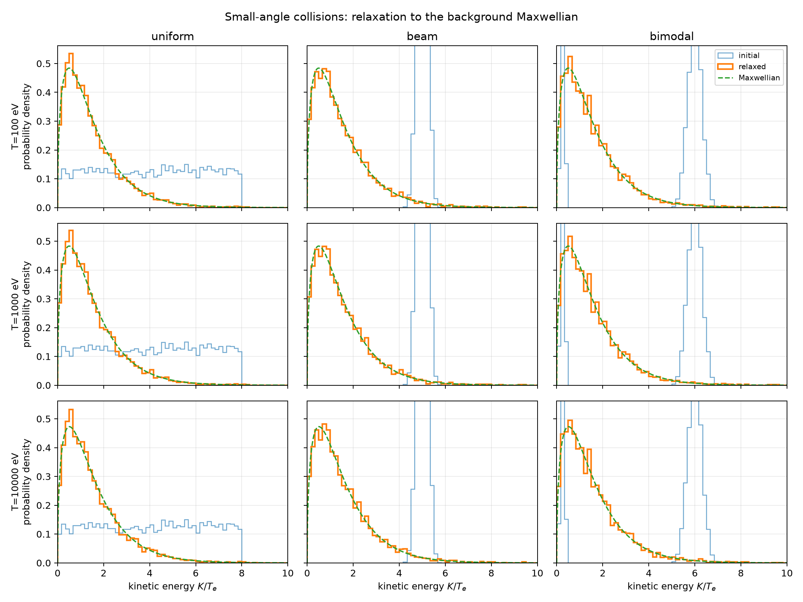
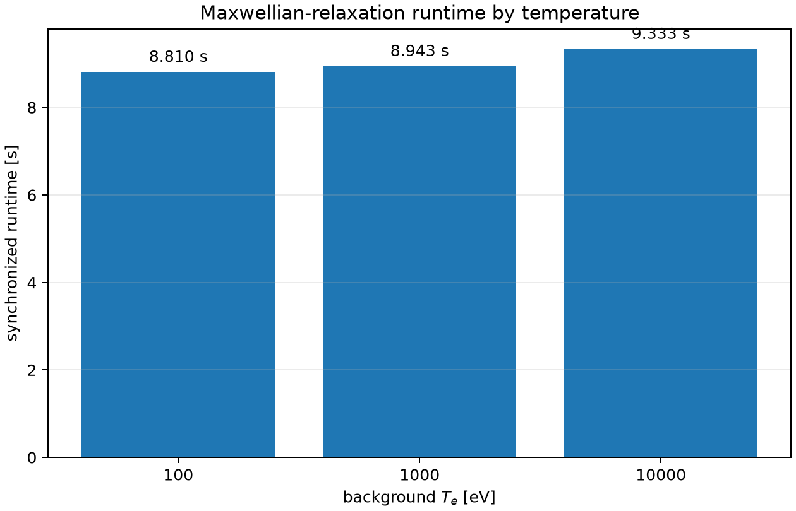
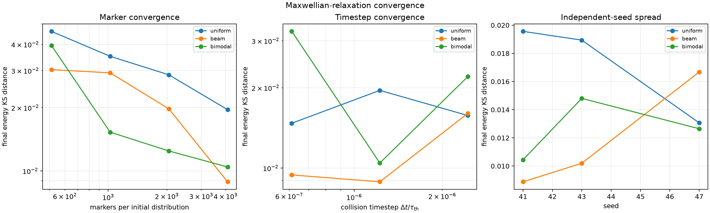
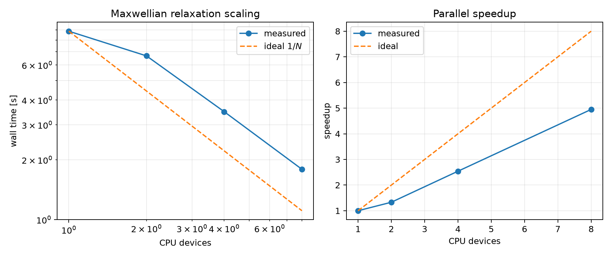

# Maxwellian relaxation

## Problem and equations

Let $f(\mathbf p,t)$ denote the energetic-electron distribution and let
$f_M(\mathbf p)$ be the fixed Maxwellian background that determines the
collision coefficients. This is the test-particle small-angle operator
obtained by linearizing the nonlinear Coulomb collision operator about
$f_M$. The spatially homogeneous equation, with all forces and sources
disabled, is

```math
\frac{\partial f}{\partial t}
=C_{\rm SA}[f;f_M].
```

JONTA represents the linearized small-angle operator in Fokker–Planck form,

```math
C_{\rm SA}[f;f_M]
=-\nabla_{\mathbf p}\!\cdot\!\left(\mathbf A[f_M]f\right)
+\frac{1}{2}\nabla_{\mathbf p}\nabla_{\mathbf p}:
 \left(\mathbf D[f_M]f\right)
=-\nabla_{\mathbf p}\!\cdot\boldsymbol{\Gamma}_{\mathbf p},
```

where $\mathbf A$ is the collisional-friction vector and $\mathbf D$ is the
diffusion tensor. The tensor contains energy diffusion and pitch-angle
diffusion; both coefficients are evaluated from the prescribed
$n_e$, $T_e$, and $Z_{\rm eff}$.

For a relativistic Maxwellian background,

```math
f_M(p)=\mathcal N
\exp\!\left[-\frac{\gamma-1}{\theta_e}\right],
\qquad
\gamma=\sqrt{1+\frac{p^2}{m_e^2c^2}},
\qquad
\theta_e=\frac{T_e}{m_ec^2}.
```

The Maxwellian is isotropic, so $\partial_\xi f_M=0$ for
$\xi=p_\parallel/p$. The friction and energy-diffusion coefficients obey the
Einstein (detailed-balance) relation

```math
A_i[f_M]
=\frac{1}{2f_M}
\frac{\partial}{\partial p_j}
\left(D_{ij}[f_M]f_M\right).
```

Consequently, the momentum-space flux vanishes identically,

```math
\boldsymbol{\Gamma}_{\mathbf p}[f_M;f_M]=0,
\qquad
C_{\rm SA}[f_M;f_M]=0.
```

The displayed identity is the analytic null-space condition. This benchmark
then tests convergence toward that equilibrium: it starts from non-equilibrium
marker distributions $f\ne f_M$ and evolves them with $C_{\rm SA}$ alone.
Finite-marker Monte Carlo trajectories fluctuate around the stationary
distribution, so this is not an exact per-marker invariance test. The
corresponding equilibrium kinetic-energy density is

```math
P_M(K)\,dK\propto p\gamma\,e^{-K/T_e}\,dK,
\qquad
p=m_ec\sqrt{\gamma^2-1}.
```

The numerical diagnostics are

```math
D_{\rm KS}(P_K,P_M)\to0,\qquad
\frac{\langle K\rangle}{\langle K\rangle_M}\to1,\qquad
\langle\xi\rangle\to0,\qquad
\langle\xi^2\rangle\to\frac13.
```

The default scan uses $T_e=100\,\mathrm{eV},1\,\mathrm{keV},10\,\mathrm{keV}$
and uniform, beam, and bimodal initial marker distributions. The fixed
collision timestep is $\Delta t=5\times10^{-3}\tau_{\rm th}$ and the
integration interval is $30\tau_{\rm th}$, with
$\tau_{\rm th}\propto(v_{Te}/c)^3$.

## Reproduce the results

Run the serial CPU benchmark:

~~~bash
PYTHONPATH=src:. JAX_PLATFORMS=cpu \
  .venv/bin/python benchmarks/slab/maxwellian_relaxation/run.py \
  --output-dir benchmark_results/slab/maxwellian_relaxation/serial
~~~

The run writes the machine-readable metrics to the file
maxwellian_relaxation.csv and produces the plots
relaxation_distributions.png, relaxation_summary.png, and runtime.png. Each
serial CSV row records the synchronized runtime for its temperature case after
JIT warm-up; the three initial distributions share one collision-kernel run.

Run the marker, timestep, and independent-seed convergence study with:

~~~bash
PYTHONPATH=src:. JAX_PLATFORMS=cpu \
  .venv/bin/python benchmarks/slab/maxwellian_relaxation/run.py \
  --convergence \
  --output-dir benchmark_results/slab/maxwellian_relaxation/convergence
~~~

The convergence output uses \(T_e=1\,\mathrm{keV}\), marker counts
\(512,1024,2048,4096\) per initial distribution, collision timesteps
\(2.5\times10^{-3},5\times10^{-3},10^{-2}\,\tau_{\rm th}\), and seeds
\(41,43,47\). It records final distribution metrics and synchronized runtime
for every case. The finite-marker KS distance decreases with marker count;
the timestep study remains statistical rather than strictly monotone, so these
results establish a resolution study but not a universal pass/fail tolerance.

## CPU scalability

The same fixed-shape kernel supports particle-sharded CPU execution. Expose
logical CPU devices before starting Python, then run:

~~~bash
XLA_FLAGS=--xla_force_host_platform_device_count=8 \
PYTHONPATH=src:. JAX_PLATFORMS=cpu \
  .venv/bin/python benchmarks/slab/maxwellian_relaxation/run.py \
  --output-dir benchmark_results/slab/maxwellian_relaxation/scaling \
  --scaling --scaling-devices 1 2 4 8
~~~

This produces scalability.csv and scalability.png, showing measured wall
time and speedup against the ideal particle-parallel scaling line. The timing
excludes one-time JIT compilation through an explicit warm-up run.

## Current CPU result

The following result was generated by the serial command above with 4096
markers per initial distribution (12,288 total markers), seed 41, and the
default timestep and run length. Values are worst-case over the uniform, beam,
and bimodal initial populations at each temperature.

| $T_e$ [eV] | max final KS distance | final $\langle K\rangle/\langle K\rangle_M$ | max $|\langle\xi\rangle|$ | max $|\langle\xi^2\rangle-1/3|$ |
| ---: | ---: | ---: | ---: | ---: |
| 100 | 0.01980 | 0.9806–1.0003 (range) | 0.01081 | 0.00401 |
| 1,000 | 0.01956 | 0.9806–1.0002 (range) | 0.01078 | 0.00399 |
| 10,000 | 0.02070 | 0.9809–0.9996 (range) | 0.01041 | 0.00397 |

The corresponding steady-state CPU timing used 12,288 total markers at
$T_e=1\,\mathrm{keV}$:

| CPU devices | wall time [s] | speedup |
| ---: | ---: | ---: |
| 1 | 8.871 | 1.00 |
| 2 | 6.664 | 1.33 |
| 4 | 3.492 | 2.54 |
| 8 | 1.792 | 4.95 |

The generated figures are included directly in the repository:









These values are reproducibility records, not hard-coded pass/fail thresholds.
Statistical tolerances belong to the benchmark configuration and should be
revisited as the marker, timestep, and seed studies are extended.

This benchmark is currently reproducible from its CLI defaults and the
manifest archived beside the generated outputs. A typed YAML configuration and
resolved-configuration archive will be added when the driver is integrated
with the repository-wide benchmark configuration loader.
